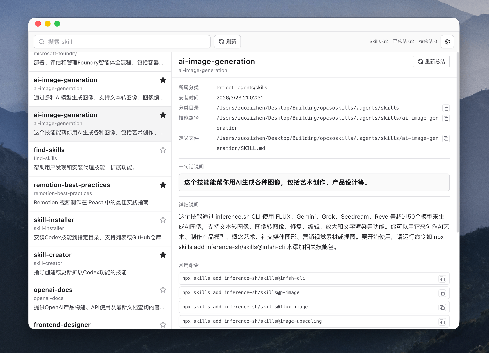

# skills-box

`skills-box` 是一个面向普通用户的 macOS 桌面应用，用来查看、管理和理解你安装的各类 AI Skills。

这不是给最终用户 `npm` 安装的命令行工具，推荐方式是直接下载打包好的 macOS 应用使用。



## 核心功能

- 自动扫描多来源 Skills（Claude/Codex/全局/项目目录 + `skills list --json`）
- 文件夹变化自动检测，发现新 Skill 会自动加入列表
- 支持收藏 Skill，菜单栏下拉仅展示收藏项，点击即可复制 Skill 路径
- 右侧详情展示关键信息：所属分类、安装时间、分类目录、技能路径、定义文件、常用命令、原始描述
- 一键刷新、后台任务执行（刷新/测试连接/AI 总结均不阻塞界面）
- 每个 Skill 支持单独“重新总结”

## AI 总结与翻译（重点）

你只需要两步：

1. 去 DeepSeek 申请一个 API Key
2. 在应用设置里填入 Key 并测试通过

之后就可以使用 AI 自动总结功能，把英文 Skill 的用途和使用方式转成更易懂的中文说明，再也不怕看不懂。

- 新发现的 Skill 可自动触发 AI 总结
- 也可手动一键总结全部未总结项
- Key 仅保存在本机：`~/.opcsoskills/config.json`
- 源码不内置任何平台密钥

## 开源与安全

- CI：`.github/workflows/ci.yml`
- 安全说明：`SECURITY.md`
- 已包含基础敏感信息扫描流程

## 开发者（可选）

如果你需要参与开发：

```bash
npm ci
npm run tauri dev
```

构建前端：

```bash
npm run build
```

检查 Rust 后端：

```bash
cd src-tauri
cargo check
```
